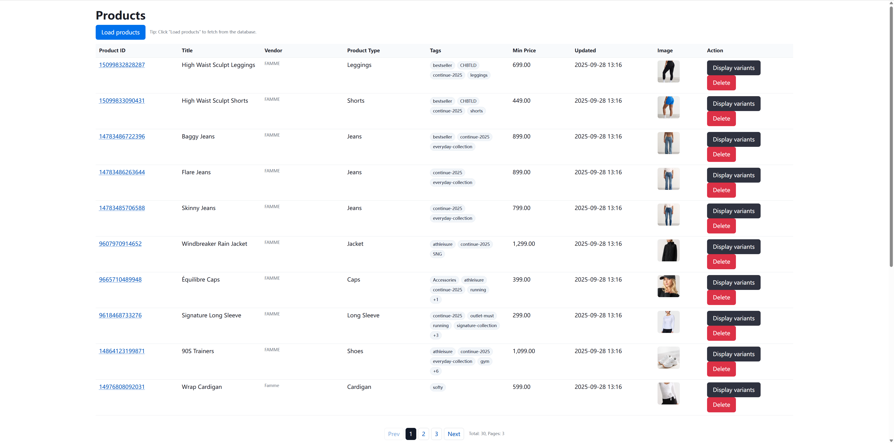
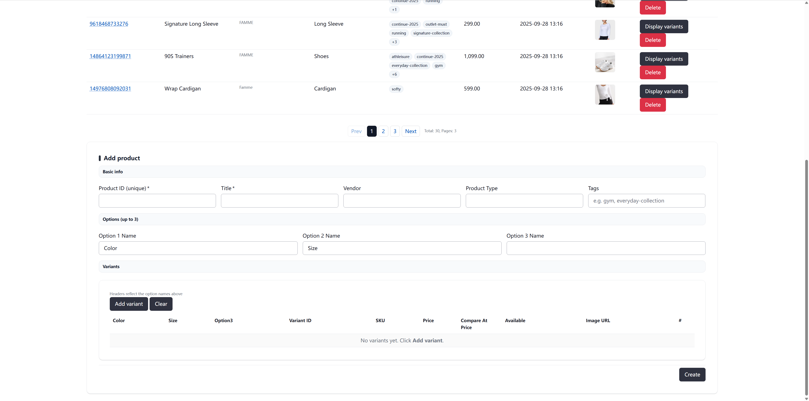

# Fullstack-test

> A small full‑stack exercise built with Spring Boot + Kotlin + Thymeleaf/HTMX. Implements the tasks from Employees Fullstack Tests using a **Products** domain as the working example.
---

## 🔍 What’s inside

* **Server**: Spring Boot 3.x, Kotlin, MVC, Validation (JSR‑380), AOP logging
* **View**: Thymeleaf fragments + HTMX 2.x (partial render, swap, retarget, triggers)
* **UI**: WebAwesome components (buttons, cards, inputs)
* **Data**: JDBC (JdbcClient), Flyway migrations
* **Build**: Gradle Wrapper

> The app favors **server-driven UI** with HTMX to keep the frontend lightweight and fast to iterate.

---

## ✅ Features mapped to the test

* **List page with pagination**
  Server-side pagination; tbody is a Thymeleaf fragment (`products/_tbody :: products_tbody`) updated via HTMX.
* **Create form with validation**
  Bean Validation on the server + client pre-checks. Error states re-render only the form fragment (`products/_form :: create_form`).
* **Edit page**
  “ProductId” in the table links to an edit page (`/products/{id}/edit`) which posts via HTMX and re-renders the form area.
* **Search with 300ms debounce**
  Typing in the search box triggers an HTMX request with a debounce of 300ms and updates only the table area.
* **CSV export for current filter**
  Export the currently filtered list as CSV (the “fourth feature” chosen for the test).
* **Delete with confirm dialog**
  Confirmation UI; on success, only the table area refreshes; emits an `product:deleted` event for hooks.
* **Import sample data**
  One‑click import of sample product + variant data to help demo pagination and search.
* **HTTP request logging (AOP)**
  Records route, status, duration, and request parameters.

---

## 🗂️ Project structure

```
src/
 └── main/
     ├── kotlin/com/…/adapter/
     │    ├── controller/       # MVC controllers and HTMX endpoints
     │    └── jobs/             # scheduled jobs
     ├── kotlin/com/…/service/  # Business logic
     ├── kotlin/com/…/repo/     # JdbcClient repositories
     ├── kotlin/com/…/common/   # Config, utils, AOP (HTTP log aspect)
     ├── resources/
     │    ├── templates/        # Thymeleaf pages & fragments
     │    │    └── products/    # list, edit, _form, _tbody
     │    └── db/migration/     # Flyway SQL migrations
     └── http/                  # JetBrains HTTP client scripts (demo calls)
```

---

## 🚀 Quick start

### Prerequisites

* JDK 21+
* A running relational database (PostgreSQL). Update `application.yml` accordingly.

### 1) Configure DB

* Create database & user (see `scripts/` if provided)

```yaml
spring:
  datasource:
    url: jdbc:postgresql://localhost:5432/fullstack_test   # or MySQL URL
    username: your_user
    password: your_password
  flyway:
    enabled: true
```

### 2) Run

```bash
./gradlew bootRun
# then open http://localhost:8080/products
```

### 3) (Optional) Seed demo data

Use the IDE HTTP client file under `http/` to hit the import endpoint, or run the provided script endpoint shown on the page.

---

## 🧭 Key UX/HTMX patterns

* **Fragment-first rendering**: pages compose `_form` & `_tbody` fragments so HTMX swaps are cheap.
* **Smart swaps**: uses `HX-Retarget` and `HX-Reswap` headers to replace only `#products` or `#create-product-card` as needed.
* **Client pre-validate**: light checks prevent bad posts; server validation remains the source of truth.
* **Events for hooks**: emits `product:created`, `product:updated`, `product:deleted` to enable toasts or refreshes.

---

## 📸 Screenshots





---

## 🔗 Routes (high-level)

* `GET /` — Home page. Renders `index`.
* `GET /products` — Table fragment for list/search/pagination. Query: `search?`, `page=1`, `size=10`. Returns `products/_tbody :: products_tbody`.
* `GET /products/form` — Create form fragment. Returns `products/_form :: create_form`.
* `POST /addProducts` — Create product (legacy route kept for HTMX). On validation error: `_form`; on success: `_tbody`. Sets `HX-Retarget: #products`, `HX-Reswap: outerHTML`, `HX-Trigger: product:created`.
* `GET /products/{productId}/variants` — Variant rows fragment. Returns `products/_variants :: variants_rows`.
* `GET /products/search` — Full search page. Returns `products/search`.
* `GET /products/{productId}/edit` — Full edit page. Returns `products/edit` (404 → `errors/404`).
* `POST /products/{productId}/update` — Update (HTMX). Returns `products/edit :: edit_form`; on success sets `HX-Trigger: product:updated`; 400 if path/form mismatch.
* `DELETE /products/{productId}` — Delete product (+ variants). Returns refreshed `_tbody` with current pagination; sets `HX-Retarget: #products`, `HX-Reswap: outerHTML`, `HX-Trigger: product:deleted`.
* `GET /products/export` — CSV export (products only). Query: `search?`. Streams `products-YYYYMMDD-HHmmss.csv` via `Content-Disposition`.

---

## 🛡️ Validation & errors

* **Bean Validation** for server-side rules (e.g., unique `productId`, price format, required fields). Duplicate checks performed via repo before insert.
* Error responses re-render `_form` with field-level messages.

---

## ⚙️ Observability

* **AOP HTTP logging**: method, path, params, status, duration (ms).
* Structured logs make it easy to trace HTMX partials.

---

## 🗺️ Roadmap (nice-to-haves)

* Server-side sorting (multi-column)
* Row-level inline edit (HTMX `hx-put`)
* Defensive rate limiting for search
* E2E tests via Playwright (progressive enhancement checks)

---

## 📄 License

MIT
